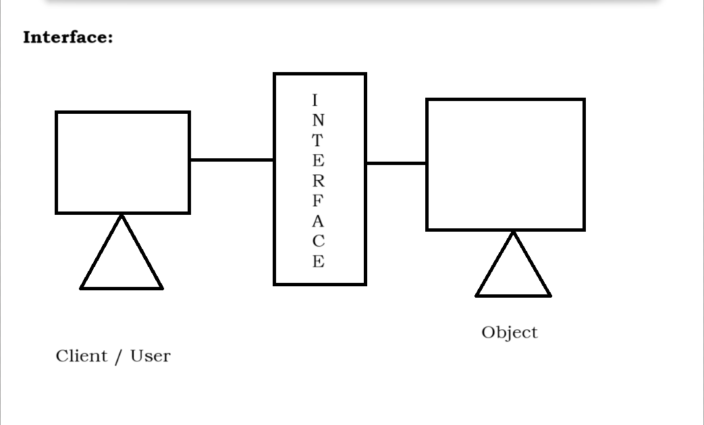
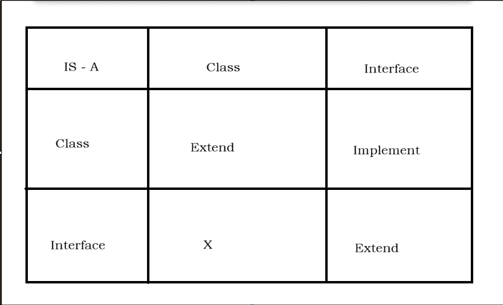
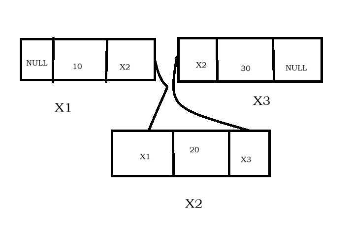
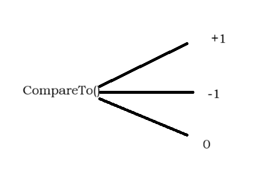

# FUEL

---

**Date:** 14/03/2025

# Core Java Basics

## Java Overview

1. **Platform Independence**: Write once, run anywhere (WORA).
2. **Object-Oriented**: Follows principles like encapsulation, inheritance, polymorphism, and abstraction.
3. **Robust**: Includes strong memory management and exception handling.
4. **Portable**: Programs written in Java can run on different hardware environments.

---

**Date:** 15/03/2025

## Data Types

1. **Primitive Data Types**:
  - `byte`, `short`, `int`, `long` – for integers.
  - `float`, `double` – for decimal values.
  - `char` – for characters.
  - `boolean` – for `true` or `false`.

2. **Non-Primitive Data Types**:
  - Strings, Arrays, Classes, and Interfaces.

### Example: Primitive vs. Non-Primitive

```java:
int number = 25; // Primitive
String text = "Hello, Java!"; // Non-Primitive
```

---

**Date:** 16/03/2025

## Control Statements

1. **Decision-Making Statements**:
  - `if`, `if-else`, `switch`

2. **Looping Statements**:
  - `for`, `while`, `do-while`

3. **Jumping Statements**:
  - `break`, `continue`

### Example: Using a Loop

```java:
for (int i = 1; i <= 5; i++) {
    System.out.println("Count: " + i);
}
```

---

**Date:** 17/03/2025

## Classes and Objects

1. **Class**: A blueprint for creating objects.
2. **Object**: An instance of a class.

### Syntax: Creating a Class and Object

```java
class Example {
    int value = 10; // Data member

    void display() { // Member function
        System.out.println("Value: " + value);
    }
}

public class Main {
    public static void main(String[] args) {
        Example obj = new Example(); // Creating an object
        obj.display(); // Accessing a method
    }
}
```

---

**Date:** 18/03/2025

## Constructors

1. **Definition**: A block of code used to initialize objects.
2. **Characteristics**:
  - Same name as the class.
  - No return type, not even `void`.

1. **Types of Constructors**:
  - Default Constructor.
  - Parameterized Constructor.

### Example: Parameterized Constructor

```java:
class Example {
    int value;

    Example(int value) { // Constructor
        this.value = value;
    }

    void display() {
        System.out.println("Value: " + value);
    }
}

public class Main {
    public static void main(String[] args) {
        Example obj = new Example(100); // Passing value to constructor
        obj.display();
    }
}
```

---

**Date:** 19/03/2025

## Access Modifiers

1. **Public**: Accessible from anywhere.
2. **Private**: Accessible only within the same class.
3. **Protected**: Accessible within the same package or by subclasses.
4. **Default**: Accessible only within the same package (no keyword required).

### Example: Using Access Modifiers

```java
class Example {
    private int value = 10;

    public void display() {
        System.out.println("Value: " + value);
    }
}

public class Main {
    public static void main(String[] args) {
        Example obj = new Example();
        obj.display();
    }
}
```

---

**Date:** 11/02/2025

## Overview
A banking system utilizing **encapsulation**, with the following data members:

- **Balance**
- **Account Number**
- **Withdrawal Amount**
- **Deposit Amount**

### Validation Rules
- If a user attempts to withdraw an amount **greater** than their balance, display:
    - **"Insufficient Balance"**
- If the balance is **sufficient**, deduct the withdrawal amount and display the remaining balance.

[BankingSystem](src/BankingSystem)

---

## Method Binding

## Polymorphism
Polymorphism refers to the ability of a method to take multiple forms, allowing different behaviors based on the object invoking it.

### Types of Polymorphism

#### 1. Compile-Time Polymorphism
- Achieved through **method overloading**.
- Also known as **early binding** or **static binding**.
- The method to be executed is determined **at compile time** by the compiler.

#### 2. Run-Time Polymorphism
- Achieved through **method overriding**.
- Also known as **late binding** or **dynamic binding**.
- The method to be executed is determined **at runtime** by the JVM.

---

**Date:** 12/03/2025

## Abstraction
Abstraction is the process of hiding implementation details while exposing only essential functionalities to the user. This is achieved using **abstract classes** or **interfaces**.

### Key Concepts of Abstraction
1. **Abstract class or interface** is required for abstraction.
2. Uses an **"is-a" relationship** (Inheritance).
3. Utilizes **method overriding**.
4. Supports **upcasting**.

### Important Notes:
- An **abstract class** cannot be instantiated.
- An **abstract method** cannot be **private**, **static**, or **final**.

### Abstract Concepts
- `abstract` is a **keyword** used with classes and methods.
- A class **without** the `abstract` keyword is called a **concrete class**.
- A **concrete class** can contain **only concrete methods**.
- A class **with** the `abstract` keyword is called an **abstract class**.
- **Abstract classes** can contain both **abstract and concrete methods**.
- A **concrete method** includes both **declaration and implementation**.
- An **abstract method** has **only a declaration** and **no implementation**.
- All abstract methods **must** be declared using the `abstract` keyword.

### Additional Notes:
- A class that **inherits** an abstract class must **override all** the abstract methods.
- If a class **inherits** an abstract class but does **not** override its abstract methods, it must be declared as an **abstract class** itself.

---

### Task:

**Question:**
Develop an abstract class with a minimum of five abstract methods:

```java
abstract class Example {
    abstract void Work();
    abstract void Information();
    abstract void Develop();
    abstract void Creation();
    abstract void Update();
}

class ConcreteExample extends Example {
    void Work() {
        System.out.println("Working...");
    }
    void Information() {
        System.out.println("Displaying Information...");
    }
    void Develop() {
        System.out.println("Developing...");
    }
    void Creation() {
        System.out.println("Creating...");
    }
    void Update() {
        System.out.println("Updating...");
    }
}

public class Main {
    public static void main(String[] args) {
        Example obj = new ConcreteExample();
        obj.Work();
        obj.Information();
        obj.Develop();
        obj.Creation();
        obj.Update();
    }
}
```

---

**Date:** 13/03/2025

## Interface
[Interface Example](src/Interface)

- Interface is a java type definition which has to be declared using interface keyword.
- Interface is a media between two systems where in one system is a client/user and another system is Object with resource and service.
- Interface can have variables, those variables are automatically public, static and final.
- Interface can allow only abstract methods and those methods are automatically public and abstract.
- Classes can achieve ```is-a relationship``` with an interface using ```implements``` keyword.
- When a class implements an interface mandatory override abstract method.
- While overriding a method access specifier/modifier should be same or higher visibility.
- A class can implements any number of interfaces.
- A class can extend one class and implement any number of interface.
- It does not contain constructor.
- We cannot create Object on interface.

### 

### 


**Date: 14/03/2025**

## Exception Handling
[Exception_Handling Example](src/Exception_Handling)

1. Exception is an event or interpretation which stop the execution of a program it is called as an Exception.
2. In other words exception is a runtime interpretation which cannot be handled.
3. Errors can occur during:
   1. Compile Error - Syntax Error
   2. Runtime Error - Execution
4. The process of handling an exception is called as Exception Handling.
5. Typically, an exception is handled using ```Try Block & Catch Block.```

### Try Block & Catch Block
1. The critical line of code which gives and exception should be written inside the ```try block```.
2. If there is a try block, mandatory catch block should be present or vice versa.
3. The solution should always be written within the catch block.
4. catch block will be executed if an Exception occur.
5. One ``Try Block`` can have any number of catch block.
6. There should not be any executable lines of code between ``try and catch block``
7. It is always a good practice to handle the super class exception as the last catch block.
8. We can use the nested try and catch block in program.


*Syntax:*
```
try {
    // Code that might throw an exception
} catch (ExceptionType e) {
    // Code to handle the exception
}
```

### Java Exception Hierarchy

## Throwable (Root Class)
- **Exception** (Checked)
  - **IOException**
    - FileNotFoundException
    - EOFException
    - SocketException
  - **SQLException**
  - **ClassNotFoundException**
  - **InterruptedException**
  - **ReflectiveOperationException**
  
  - **RuntimeException** (Unchecked)
    - ArithmeticException
    - NullPointerException
    - ClassCastException
    - IndexOutOfBoundsException
      - ArrayIndexOutOfBoundsException
      - StringIndexOutOfBoundsException
    - IllegalArgumentException
      - NumberFormatException
    - UnsupportedOperationException
    - ConcurrentModificationException
- **Error** (Unchecked, Critical)
  - **OutOfMemoryError**
  - **StackOverflowError**
  - **VirtualMachineError**
  - **AssertionError**
  - **LinkageError**
    - ClassNotFoundError
    - NoClassDefFoundError

``` Note:
  We have to use multiple catch block but we have to use try block only once.
  ```

## Internally
1. An object of arithmetic exception is created.
2. the object is thrown to suitable catch block.
3. It is caught by the catch block.

### Imp method present is throwable class:
1. PrintStackTrace()
    This method is used to get complete info about the exception.
2. GetMessage()
    This method is used to return a small message about the exception occurred.

   Note : [Demo3.java](src/Exception_Handling/Demo3.java)

### Finally Block
1. The set of instructions which has to be executed all the time, has to return within the finally block.
2. Finally block is block of code which it executed all the time. i.e. irrespective of Exception occur or not.

---

### Checked Exception
1. Checked exception is known by the compiler.
2. It can be handled immediately.
3. It is called as a ```extinct exception```

### Unchecked Exception
1. It can be handled not immediately.
2. It is also called as an ``Extend Runtime exception.``

[Example of Checked and Unchecked Exception](src/Exception_Handling/Demo4.java)


---
 ## Throws
1. Throws is an indication to the caller about the possibility of an Exception.
2. Throws is used to propagate an exception.
3. Throws is generally used with check exception.
4. Typically, we use throws with methods, and it can use ``throws`` w.r.t constructor as well.

## Custom / User Defined Exception:
1. Based on object or project it is some time necessary to create our own exception and those exception which the user/programmer create are called as a custom exception or user defined exception.
2. Rules for working with custom exception:
   1. Create a class with Exception name.
   2. The exception class which we created should either inherit exception (checked) or runtime exception (unchecked) class.
   3. Create an obj of the exception class and invoke/throw obj of the exception.
   4. Handle it using try & catch block.


**Date: 15/03/2025**

## Arrays
Bubble Selection

## Collection Framework
**Date:17/03/2025**

| Array                              | Collection                                 |
|------------------------------------|--------------------------------------------|
| 1. Array stores homogeneous data   | 1. Collection stores heterogeneous data    |
| 2. Size of an array is fixed       | 2. Size of a collection is dynamic         |
| 3. Array does not have any methods | 3. Collection contains pre-defined methods |
| 4. Array does not support generics | 4. Collection supports generics            |

### Collections
Collection is a pre-defined interface.
It is stored into ``java.util`` package.
Collection means group of objects.

## Hierarchy of Collection framework in Java


Pre-defined methods in collection interface

| No. | Method           | Syntax                     | Description                                                                           |
|-----|------------------|----------------------------|---------------------------------------------------------------------------------------|
| 1.  | `.add()`         | `.add(item)`               | Adds an item to the collection if it wasn’t a member already.                         |
| 2.  | `.addAll()`      | `.addAll(collection)`      | Adds all elements in the given collection to the collection.                          |
| 3.  | `.remove()`      | `.remove(item)`            | Removes an item from the collection.                                                  |
| 4.  | `.removeAll()`   | `.removeAll(collection)`   | Removes all items in the given collection from the collection.                        |
| 5.  | `.contains()`    | `.contains(item)`          | Returns `true` if the item is present in the collection.                              |
| 6.  | `.containsAll()` | `.containsAll(collection)` | Returns `true` if all items in the given collection are present.                      |
| 7.  | `.isEmpty()`     | `.isEmpty()`               | Returns `true` if the collection is empty.                                            |
| 8.  | `.clear()`       | `.clear()`                 | Removes all elements from the collection.                                             |
| 9.  | `.size()`        | `.size()`                  | Returns the number of elements in the collection.                                     |
| 10. | `.iterator()`    | `.iterator()`              | Returns an iterator to traverse through the collection.                               |
| 11. | `.get()`         | `.get()`                   | Returns an object based on index position.                                            |
| 12. | `.indexOf()`     | `.indexOf()`               | Used to find index position of an object and first occurrence in case of duplication. |
| 12. | `.set()`         | `.set()`                   | Used to find index position of an object and first occurrence in case of duplication. |

## 1. List

It is a predefined interface. `List` is stored in the `java.util` package.  
`List` was introduced in **JDK 1.2**.

### **Types of List:**
- `ArrayList`
- `LinkedList`
- `Vector`
- `Stack`

### **Specifications of List:**
1. List stores data in **insertion order**.
2. **Duplicates** are allowed in a List.
3. List is **index-based**.
4. `null` values can be inserted in a List.

#### **Example:**
```java:
List L1 = new ArrayList();
          new LinkedList();
          new Vector();
          new Stack();
```

### **1.1 Array List**
1. It is a pre-defined class.
2. it is stored into ``java.util`` package.
3. It is introduced from ``jdk 1.2``.

### **Specification of Array List**
1. The initial capacity of array list is 10.
2. Incremental Capacity of Array List is
   ``Incremental Capacity = { (Current Capacity / 2) * 3 } + 1``
3. Array List is ``re-sizable array`` or ``growable array``.

[Example](src/ArrayList/Demo.java)
```java
package ArrayList;

import java.util.ArrayList;

public class Demo {
    public static void main(String[] args) {
        ArrayList al = new ArrayList();
        al.add(10);
        al.add(20);
        al.add("SAM");
        al.add(20.5);
        al.add(null);
        al.add(20);
        System.out.println("Array List : " + al);
    }
}
```


**Date:18/03/2025**
### **1.2 Linked List**
1. Linked List is a predefined class.
2. It is stored into ``java.util`` package.
3. It is introduced from ``JDK 1.2``.



### **Specification of Linked List**
1. The initial capacity of Linked List is zero or null.
2. The Incremental capacity of Linked List is 1 or depends upon object.

[Linked List Example](src/LinkedList/Demo.java)

1. Add() is used to Appending elements randomly inside array list using index value and element value by changing position of other elements.
2. set() is used to add an object based on the index position and already existing object get override.

```java
public class Demo1 {
    public static void main(String[] args) {
        ArrayList al = new ArrayList();
        al.add(10);
        al.add(20);
        al.add(30);
        al.add(40);

        System.out.println(al);

        al.add(1,70);
        System.out.println(al);

        al.set(1, 50);
        System.out.println(al);
    } 
}
```

### For Each Loop
Example:
```java
        for (int i : Arr){
            if (i%2==0){
                System.out.println(in);
            }
```

## Vector
1. It is a pre-defined class which is stored into ``java.util`` package.
2. It is introduced from ```jdk 1.2```.
3. Initial Capacity of vector is ``10``.
4. Incremental Capacity of vector is ``CurrentCapacity * 2``.
5. It is also called as a ``Thread-Safe`` (synchronized).


Array List is not thread same.                                  Vector is thread same.
Array list three constructors.                                  Vector have 4 constructor
Incremental Capacity of Array List is
``Incremental Capacity = { (Current Capacity / 2) * 3 } + 1``   Incremental Capacity of vector is ``CurrentCapacity * 2``.
It is introduced from ``jdk 1.2``                               It is introduced from ``jdk 1.0``

## Set
Set is a pre-defined interface which is stored into ``java.util`` package.
It is introduced from ``jdk 1.2``


| Set                                             | List                                     |
|-------------------------------------------------|------------------------------------------|
| Insertion order in ``set`` is not followed.     | Insertion order in ``list`` is followed. |
| In ``set`` duplicates are not allowed.          | Duplicates in ``list`` are allowed.      |
| ``Set`` is not an index based.                  | ``List`` is index based.                 |
| Null value is allowed in ``set`` only one time. | Null values allowed multiple times.      |


### HashSet:
1. It is pre-defined class which is stored in ``java.util`` package.
2. It is also underlined DSA of collection.
3. Initial capacity of HashSet is ``16``.
4. ```Incremental Capacity is 75 % of Initial capacity.```

### LinkHashSet
1. LinkHashSet is a pre-defined class which stored into ``java.util`` package.
2. It is introduced from ``jdk 1.4``
3. It is the updated version of HashSet.
4. LinkHashSet cannot allow duplicate values.
5. LinkHashSet follow ``insertion order``.
6. Initial Capacity `16`.


### TreeSet
1. It is a pre-defined class and stored in ``jaav.util`` package.
2. It is introduced from ``jdk 1.2``
3. TreeHashSet it contains ``compareTo()``.



**Date: 22/03/2025**
### Map:
1. Map is a pre-defined interface which is stored into ``java.util`` package.
2. It is introduced from `jdk 1.2`.
3. Map store the data with the help of keys and values and group of keys and values we call it as an element or ``entries``.

| Key | Value | 
|-----|-------| 
| 101 | Tom   | 
| 102 | Sam   | 
| 103 | Sim   | 

Hierarchy of Map Interface

            java.util.Map()
                    |
---------------------------------------
|                   |                 |
HashMap(c)      SortedMap()         HashTable
|

1. Map is part of collection framework which does not extend the collection interface.
2. Map is used to organize the data in terms of `is-an` value pair.
3. Keys cannot be duplicate, values can be duplicate.
4. Map is pre-defined interface present in `java.util` package.
5. The implementation classes of the map.
   
**Classes**
1. HashMap()
2. LinkedHashMap

6. One key and one value together we call it as an entry, therefore in order map in a collection we call it as an entries.

### Imp methods used w.r.t Map
1. Put()
2. Get()
3. Clear()
4. isEmpty()
5. remove()
6. containsKey()
7. containsValue()
8. KeySet()

### Map()=>
HashMap:
1. It is a predefined class which iss stored into `java.util` package and introduced from ``jdk 1.2``.
2. In HashMap insertion order is not maintained.
3. In HashMap duplicates are allowed but only in `values/elements` not in `keys`.

### LinkedHashMap
1. It is a pre-defined class which is stored into ``java.util`` package, and it is introduced in ``jdk 1.2``.
2. LinkedHashMap does follow insertion order or maintain the insertion order.
3. For Iterating with the help of keys:
    ```Set<String> str = lm.keySet();```
4. For Iterating with the help of values:
    ````Collection <Integer> str = lm.values();````

### TreeMap
1. It is a pre-defined class which is stored into ``java.util`` package, and it is introduced in ``jdk 1.2``.
2. TreeMap maintains sorted order i.e. Sorting based on the keys in ascending order.
3. Example:
```
lm.put("Sam", 1234567);
lm.put("Tim", 1234567);
```

Here’s the content rewritten in proper Markdown format:

---

**Date:** 25/03/2025

## MySQL

### Database:
A database is an organized collection of interrelated data or a structured collection.

1. **DBMS (Database Management System):**  
   It is a type of software used to manage multiple databases.

2. **RDBMS (Relational Database Management System):**  
   It is software that follows the relational model. In this model, data is stored in two-dimensional tables.

3. `RDBMS` is an extension of `DBMS`.

4. Various RDBMS software available in the market:
    - **MySQL:** Owned by Oracle Corporation.
    - **Oracle:** Also owned by `Oracle Corporation`.
    - **Postgres:** Open-source RDBMS software.
    - **SQL Server:** Owned by `Microsoft`.
    - **DB2:** Owned by `IBM`.

---

## keynotes

**Note:** Every RDBMS software is essentially a DBMS software, but the reverse is not true.  
*Example:* MongoDB is a DBMS software, but it is not an RDBMS software.

---

## SQL (Structured Query Language)

To work with `RDBMS` software, we need to use SQL, which stands for Structured Query Language. It is an interface that enables us to interact with any kind of `RDBMS` software.

### Important Notes:
1. Whenever we install RDBMS software, a database is automatically created at the physical level (i.e., hard disk).
2. Each `RDBMS` software has a key component called the **database engine**, which executes SQL commands (statements).
3. To execute any SQL commands using the database engine, we require a client application.
    - During MySQL installation, the `mysql` command-line client is provided to execute SQL statements with the database engine.
    - GUI clients like *MySQL Workbench* can also be installed for MySQL.

---

## SQL Queries

- SQL is **case-sensitive**.
- SQL language comprises several predefined commands:
    1. **DDL** - Data Definition Language
    2. **DML** - Data Manipulation Language
    3. **DRL** - Data Retrieval Language
    4. **TCL** - Transaction Control Language
    5. **DCL** - Decision Control Language

```plaintext
In real-time application development, Java developers are only permitted to perform DML, DRL, and DCL commands, while other commands are typically used by the DBA.
```

---

### 1. DDL (Data Definition Language)

DDL commands are used to create, alter, drop, truncate, or rename data.

**To add a column to a table:**

```sql
ALTER TABLE table1 ADD State VARCHAR(50);
```

---

### 2. DML (Data Manipulation Language)

DML commands allow us to insert, delete, or update data.

**Example of updating data:**

```sql
UPDATE table1 SET State = 'Mumbai' WHERE id = 102;
```

---

### 3. DRL (Data Retrieval Language)

In DRL, we retrieve data from the database.

---

### 4. TCL (Transaction Control Language)

TCL commands handle transactions in the database.

---

### 5. DCL (Decision Control Language)

DCL commands manage permissions and access controls in the database.

---

### Example: Inserting Data into a Table

**Creating a table (id, name, city, country) and inserting values:**

```sql
INSERT INTO example (id, name, city, country) VALUES (2, 'Sajeed', 'Dhaisar', 'India');
INSERT INTO example (id, name, city, country) VALUES (3, 'Nihal', 'Dhaisar', 'India');
INSERT INTO example (id, name, city, country) VALUES (4, 'Mona', 'Dhaisar', 'India');
INSERT INTO example (id, name, city, country) VALUES (5, 'Yash', 'Urun-Islampur', 'India');
INSERT INTO example (id, name, city, country) VALUES (6, 'Aamir', 'Karad', 'India');
INSERT INTO example (id, name, city, country) VALUES (7, 'Farhan', 'Mumbai', 'India');
INSERT INTO example (id, name, city, country) VALUES (8, 'Shahrukh', 'Dubai', 'Saudi Arabia');
INSERT INTO example (id, name, city, country) VALUES (9, 'Tahir', 'Tamabve', 'India');
```

---

### Additional Note

```note
We cannot use the `OR` statement to define a range.
```

```plaintext
mysql> SELECT * FROM example WHERE id in(1,3,5,6);

+----+-------+---------------+---------+
| id | name  | city          | country |
+----+-------+---------------+---------+
|  1 | Aman  | Islampur      | India   |
|  3 | Nihal | Dhaisar       | India   |
|  5 | Yash  | Urun-Islampur | India   |
|  6 | Aamir | Karad         | India   |
+----+-------+---------------+---------+
```
```plaintext
mysql> SELECT * FROM example order by name ASC;
+----+----------+---------------+--------------+
| id | name     | city          | country      |
+----+----------+---------------+--------------+
|  6 | Aamir    | Karad         | India        |
|  1 | Aman     | Islampur      | India        |
|  7 | Farhan   | Mumbai        | India        |
|  4 | Mona     | Dhaisar       | India        |
|  3 | Nihal    | Dhaisar       | India        |
|  2 | Sajeed   | Dhaisar       | India        |
|  8 | Shahrukh | Dubai         | Saudi Arabia |
|  9 | Tahir    | Tamabve       | India        |
|  5 | Yash     | Urun-Islampur | India        |
+----+----------+---------------+--------------+
9 rows in set (0.00 sec)

mysql> SELECT * FROM example order by name DESC;
+----+----------+---------------+--------------+
| id | name     | city          | country      |
+----+----------+---------------+--------------+
|  5 | Yash     | Urun-Islampur | India        |
|  9 | Tahir    | Tamabve       | India        |
|  8 | Shahrukh | Dubai         | Saudi Arabia |
|  2 | Sajeed   | Dhaisar       | India        |
|  3 | Nihal    | Dhaisar       | India        |
|  4 | Mona     | Dhaisar       | India        |
|  7 | Farhan   | Mumbai        | India        |
|  1 | Aman     | Islampur      | India        |
|  6 | Aamir    | Karad         | India        |
+----+----------+---------------+--------------+
9 rows in set (0.00 sec)

mysql> SELECT * FROM example order by city DESC;
+----+----------+---------------+--------------+
| id | name     | city          | country      |
+----+----------+---------------+--------------+
|  5 | Yash     | Urun-Islampur | India        |
|  9 | Tahir    | Tamabve       | India        |
|  7 | Farhan   | Mumbai        | India        |
|  6 | Aamir    | Karad         | India        |
|  1 | Aman     | Islampur      | India        |
|  8 | Shahrukh | Dubai         | Saudi Arabia |
|  2 | Sajeed   | Dhaisar       | India        |
|  3 | Nihal    | Dhaisar       | India        |
|  4 | Mona     | Dhaisar       | India        |
+----+----------+---------------+--------------+
9 rows in set (0.00 sec)

mysql> SELECT * FROM example order by country DESC;
+----+----------+---------------+--------------+
| id | name     | city          | country      |
+----+----------+---------------+--------------+
|  8 | Shahrukh | Dubai         | Saudi Arabia |
|  1 | Aman     | Islampur      | India        |
|  2 | Sajeed   | Dhaisar       | India        |
|  3 | Nihal    | Dhaisar       | India        |
|  4 | Mona     | Dhaisar       | India        |
|  5 | Yash     | Urun-Islampur | India        |
|  6 | Aamir    | Karad         | India        |
|  7 | Farhan   | Mumbai        | India        |
|  9 | Tahir    | Tamabve       | India        |
+----+----------+---------------+--------------+
9 rows in set (0.00 sec)

```

```plaintext
mysql> SELECT * FROM example order by id desc limit 2;
+----+----------+---------+--------------+
| id | name     | city    | country      |
+----+----------+---------+--------------+
|  9 | Tahir    | Tamabve | India        |
|  8 | Shahrukh | Dubai   | Saudi Arabia |
+----+----------+---------+--------------+
2 rows in set (0.00 sec)
```


```Question
Question: Create a table of employees and create 4 columns Id, EmpName, EmpSalary, and EmpDepartment and Designation.
The salary range should be 10,000 to 50,000. Have minimum 5 entries:
1. Write a query detail of all employees earning a salary greater than 50000 where the designation of employee is Manager or Software Developer.
2. Write a query name of the employee and his job if it only works as a manager.
```

```Answer
mysql> INSERT INTO employees (Id, EmpName, EmpSalary, EmpDepartment, Designation)
    -> VALUES 
    -> (1, 'Aman', 50000, 'I.T', 'Manager'),
    -> (2, 'Alfaj', 24000, 'I.T', 'Developer'),
    -> (3, 'Yash', 20000, 'HR', 'Associate'),
    -> (4, 'Honey', 40000, 'I.T', 'Network Engineer Associate'),
    -> (5, 'Bob', 15000, 'Marketing', 'Executive');
Query OK, 5 rows affected (0.02 sec)
Records: 5  Duplicates: 0  Warnings: 0

mysql> select * from employees;
+----+---------+-----------+---------------+----------------------------+
| Id | EmpName | EmpSalary | EmpDepartment | Designation                |
+----+---------+-----------+---------------+----------------------------+
|  1 | Aman    |  50000.00 | I.T           | Manager                    |
|  2 | Alfaj   |  24000.00 | I.T           | Developer                  |
|  3 | Yash    |  20000.00 | HR            | Associate                  |
|  4 | Honey   |  40000.00 | I.T           | Network Engineer Associate |
|  5 | Bob     |  15000.00 | Marketing     | Executive                  |
+----+---------+-----------+---------------+----------------------------+
5 rows in set (0.00 sec)

mysql> select * from employees where EmpSalary > 50000;
Empty set (0.00 sec)

mysql> select * from employees where EmpSalary >= 50000;
+----+---------+-----------+---------------+-------------+
| Id | EmpName | EmpSalary | EmpDepartment | Designation |
+----+---------+-----------+---------------+-------------+
|  1 | Aman    |  50000.00 | I.T           | Manager     |
+----+---------+-----------+---------------+-------------+
1 row in set (0.00 sec)

mysql> select EmpName, Designation from employees where Designation = 'Manager';
+---------+-------------+
| EmpName | Designation |
+---------+-------------+
| Aman    | Manager     |
+---------+-------------+
1 row in set (0.00 sec)
```


- Write a query show the database of employee name and employee salary with hike of 10% if the salary is < 30,000.
```text
mysql> select * from employees;
+----+---------+-----------+---------------+----------------------------+
| Id | EmpName | EmpSalary | EmpDepartment | Designation                |
+----+---------+-----------+---------------+----------------------------+
|  1 | Aman    |  50000.00 | I.T           | Manager                    |
|  2 | Alfaj   |  24000.00 | I.T           | Developer                  |
|  3 | Yash    |  20000.00 | HR            | Associate                  |
|  4 | Honey   |  40000.00 | I.T           | Network Engineer Associate |
|  5 | Bob     |  15000.00 | Marketing     | Executive                  |
+----+---------+-----------+---------------+----------------------------+
5 rows in set (0.00 sec)

mysql> SELECT 
    ->     EmpName,
    ->     EmpSalary,
    ->     CASE
    ->         WHEN EmpSalary < 30000 THEN EmpSalary * 1.1
    ->         ELSE EmpSalary
    ->     END AS NewSalary
    -> FROM
    ->     employees;
+---------+-----------+-----------+
| EmpName | EmpSalary | NewSalary |
+---------+-----------+-----------+
| Aman    |  50000.00 |  50000.00 |
| Alfaj   |  24000.00 | 26400.000 |
| Yash    |  20000.00 | 22000.000 |
| Honey   |  40000.00 |  40000.00 |
| Bob     |  15000.00 | 16500.000 |
+---------+-----------+-----------+
5 rows in set (0.00 sec)
```
                                    --- OR ---
```text

mysql> SELECT EmpName, EmpSalary, 
    ->        CASE 
    ->            WHEN EmpSalary < 30000 THEN EmpSalary * 1.1
    ->            ELSE EmpSalary 
    ->        END AS NewSalary,
    ->        CASE
    ->            WHEN EmpSalary < 30000 THEN EmpSalary * 0.1
    ->            ELSE 0
    ->        END AS Increment
    -> FROM employees;
+---------+-----------+-----------+-----------+
| EmpName | EmpSalary | NewSalary | Increment |
+---------+-----------+-----------+-----------+
| Aman    |  50000.00 |  50000.00 |         0 |
| Alfaj   |  24000.00 | 26400.000 |  2400.000 |
| Yash    |  20000.00 | 22000.000 |  2000.000 |
| Honey   |  40000.00 |  40000.00 |         0 |
| Bob     |  15000.00 | 16500.000 |  1500.000 |
+---------+-----------+-----------+-----------+
5 rows in set (0.01 sec)
```
**Solution by sir**
```text
mysql> update employees set EmpSalary=EmpSalary+(EmpSalary*10/100) where EmpSalary<=55000;
Query OK, 5 rows affected (0.03 sec)
Rows matched: 5  Changed: 5  Warnings: 0

mysql> select * from employees;                                                            
+----+---------+-----------+---------------+----------------------------+
| Id | EmpName | EmpSalary | EmpDepartment | Designation                |
+----+---------+-----------+---------------+----------------------------+
|  1 | Aman    |  55000.00 | I.T           | Manager                    |
|  2 | Alfaj   |  26400.00 | I.T           | Developer                  |
|  3 | Yash    |  22000.00 | HR            | Associate                  |
|  4 | Honey   |  44000.00 | I.T           | Network Engineer Associate |
|  5 | Bob     |  16500.00 | Marketing     | Executive                  |
+----+---------+-----------+---------------+----------------------------+
5 rows in set (0.00 sec)

```
**Question 4 :**
write down a query of a data Employee ID and EmpName if they are working in department of I.T and Marketing where the EmpSalary is between 30000 and 55000.
```text
    SELECT Id AS EmployeeId, EmpName
    FROM employees
    WHERE EmpDepartment IN ('I.T', 'Marketing')
    AND EmpSalary BETWEEN 30000 AND 55000;
```
**Output**
```
+------------+---------+
| EmployeeId | EmpName |
+------------+---------+
|          1 | Aman    |
|          4 | Honey   |
+------------+---------+
2 rows in set (0.00 sec)
```

---

(26/03/2025)
## Primary Key
- A `DB engine` automatically creates an index for a column defined as a primary key.
- Values in a primary key column **cannot be duplicated** and **cannot be NULL**.
- A primary key is unique and different from other constraints. While a table can have multiple unique constraints, it can only have **one primary key**.
- If we want to apply a primary key across multiple columns in a table, it is referred to as a **composite key**.

**Note:**  
A primary key column helps uniquely identify each record in a table.

## Foreign Key
- A foreign key helps enforce **referential integrity**.
- It establishes a relationship between two tables:
    - The foreign key column in the child table must reference the primary key column in the parent table.
    - The primary key and foreign key columns must have the **same data type**, though their names can differ.
- Foreign key columns can accept **duplicates** and **NULL values**.
- Foreign keys help define **parent-child relationships** among tables.
