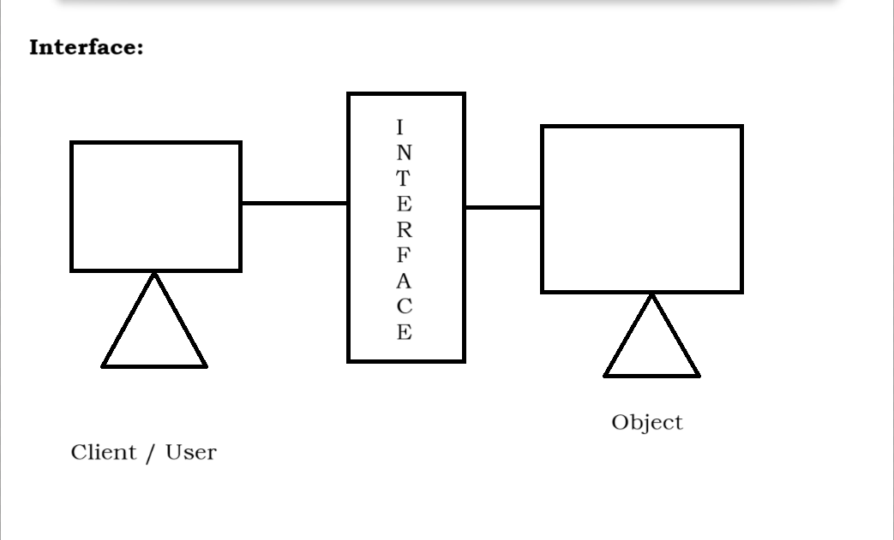

# FUEL

**Date:** 11/02/2025

## Overview
A banking system utilizing **encapsulation**, with the following data members:

- **Balance**
- **Account Number**
- **Withdrawal Amount**
- **Deposit Amount**

### Validation Rules
- If a user attempts to withdraw an amount **greater** than their balance, display:
    - **"Insufficient Balance"**
- If the balance is **sufficient**, deduct the withdrawal amount and display the remaining balance.

---

## Method Binding

## Polymorphism
Polymorphism refers to the ability of a method to take multiple forms, allowing different behaviors based on the object invoking it.

### Types of Polymorphism

#### 1. Compile-Time Polymorphism
- Achieved through **method overloading**.
- Also known as **early binding** or **static binding**.
- The method to be executed is determined **at compile time** by the compiler.

#### 2. Run-Time Polymorphism
- Achieved through **method overriding**.
- Also known as **late binding** or **dynamic binding**.
- The method to be executed is determined **at runtime** by the JVM.

---

**Date:** 12/03/2025

## Abstraction
Abstraction is the process of hiding implementation details while exposing only essential functionalities to the user. This is achieved using **abstract classes** or **interfaces**.

### Key Concepts of Abstraction
1. **Abstract class or interface** is required for abstraction.
2. Uses an **"is-a" relationship** (Inheritance).
3. Utilizes **method overriding**.
4. Supports **upcasting**.

### Important Notes:
- An **abstract class** cannot be instantiated.
- An **abstract method** cannot be **private**, **static**, or **final**.

### Abstract Concepts
- `abstract` is a **keyword** used with classes and methods.
- A class **without** the `abstract` keyword is called a **concrete class**.
- A **concrete class** can contain **only concrete methods**.
- A class **with** the `abstract` keyword is called an **abstract class**.
- **Abstract classes** can contain both **abstract and concrete methods**.
- A **concrete method** includes both **declaration and implementation**.
- An **abstract method** has **only a declaration** and **no implementation**.
- All abstract methods **must** be declared using the `abstract` keyword.

### Additional Notes:
- A class that **inherits** an abstract class must **override all** the abstract methods.
- If a class **inherits** an abstract class but does **not** override its abstract methods, it must be declared as an **abstract class** itself.

---

### Task:

**Question:**
Develop an abstract class with a minimum of five abstract methods:

```java
abstract class Example {
    abstract void Work();
    abstract void Information();
    abstract void Develop();
    abstract void Creation();
    abstract void Update();
}

class ConcreteExample extends Example {
    void Work() {
        System.out.println("Working...");
    }
    void Information() {
        System.out.println("Displaying Information...");
    }
    void Develop() {
        System.out.println("Developing...");
    }
    void Creation() {
        System.out.println("Creating...");
    }
    void Update() {
        System.out.println("Updating...");
    }
}

public class Main {
    public static void main(String[] args) {
        Example obj = new ConcreteExample();
        obj.Work();
        obj.Information();
        obj.Develop();
        obj.Creation();
        obj.Update();
    }
}
```

---

**Date:** 13/03/2025

## Interface
- Interface is a java type definition which has to be declared using interface keyword.
- Interface is a media between two systems where in one system is a client/user and another system is Object with resource and service.
- Interface can have variables, those variables are automatically public, static and final.
- Interface can allow only abstract methods and those methods are automatically public and abstract.
- Classes can achieve ```is-a relationship``` with an interface using ```implements``` keyword.
- When a class implements an interface mandatory override abstract method.
- While overriding a method access specifier/modifier should be same or higher visibility.
- A class can implements any number of interfaces.
- A class can extend one class and implement any number of interface.
- It does not contain constructor.
- We cannot create Object on interface.

### 

